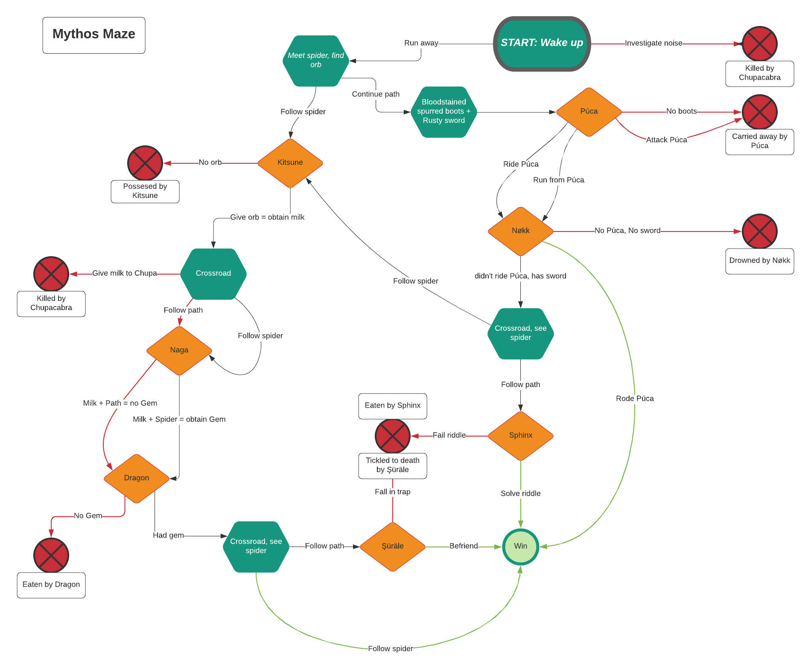
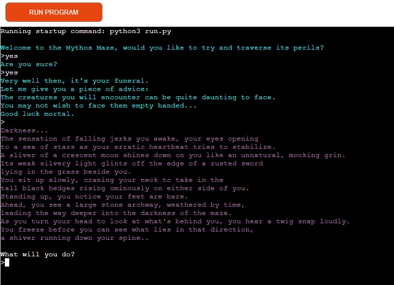
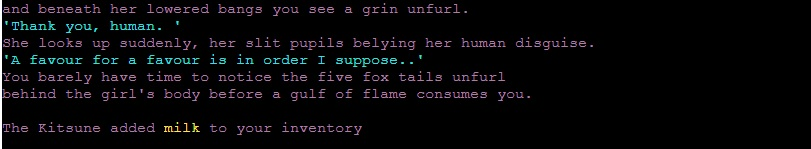
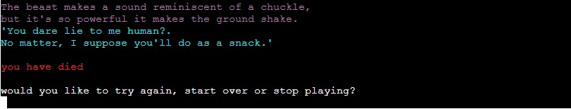

# Mythos Maze
[Mythos Maze](https://mythos-maze.herokuapp.com/) is a Python terminal adventure game, which runs on the Code Institute mock terminal on Heroku.

Users can go on an adventure in the Mythos Maze filled with Mythological creatures from different cultures all over the world. Depending on their choices they will either find their way out, or become a victim of one of the many creatures the maze houses.  
 
  
*The Sphinx is one of the creatures you might encounter inside the Mythos Maze*  
  
## UX Design  
### User stories
* As a user I feel an adventure game should be as intuitive as possible:  
    * The game's introduction asks the user whether they wish to play or not. If they answer yes they will be given a hint on how to conquer the Maze.
    * Throughout the Maze the user will be asked questions: 'What will you do?', 'What will you say?' etc. Their input can be freely given, the game will react differently depending on their feedback. Though this is riskier, I hope it will make the game more immersive.  
    * The game contains a lot of descriptive text, both to bring life to the maze and to inform the user of everything they can potentially interact with.
    * The user can request to see the contents of their inventory, or quit the game, at any time. They need to discover this themselves however. Like the player character, they are 'dropped' into an unfamiliar world and have to figure things out as they go.
    * If the player reaches the official end of the game (there is also a way to leave the maze earlier, if a user manages to find it), they can ask for more information on the creatures they've encountered.
    * Should the player die, they will be asked whether they wish to 'try again' (from the part where they died), 'start over' (from the beginning) or 'stop playing'.

### Site goals
* Create a fun adventure which is easy to navigate.
* Spark some interest in the many mythological creatures that exist in (ancient) folklore.
* Teach the user more about the creatures they've encountered when they reach the end of the game.  

### Flowchart
  

* Differences to original design  
   * In the original design, there is an option to offer the milk to the Chupacabra in an attempt to placate it.  
     However this meant coming face to face with him and as the milk wasn't going to work on him this would mean the player couldn't realistically get away from him at that point. This part of the story was removed.  
     Instead, the user can choose to drink the milk, which would still create the desired effect of removing the milk from the user's inventory.  
     *Which is a bad idea, but the player needs to find this out for themselves*  
   * In the original design, the bloodstained boots and rusted sword are in the same area. As there was only one area that contained two items and all other areas only contained a maximum of one item, it seemed more frugal to place the rusted sword elsewhere and give the location class only one item attribute.  

## Features  
### Existing features
* Game introduction:  
  The game first asks the user whether they wish to play or not, from the very beginning the responses a user gets depend completely on their choice of input.  
  Aside from yes or no, uncertain answers will receive a different response as well.  
  

* Obtain items:  
  The user can obtain different items which will be necessary to win the game.  
  These can be either found / obtained by the user or given to them by benevolent creatures (though the user must get on their good side first).  
  The user can check what's inside their inventory at any time during the game, the correct input in response to the "What will you do?" question will reveal the current contents.  

* Game over:  
  To prevent the game simply ending when the user dies, the user is given the option to try again, start over or stop playing.  
  

* Unknown input:  
  Unfortunately it was impossible to account for all possible inputs a user might give the game. In case something is entered which has no known response, the following output will be returned, and the game will once again ask the user what they want to do.  
  

* Different colours:  
  Since the game contains a lot of story / text, different colours have been added to make it easier for the user to keep an overview. Narration is purple, spoken text is cyan, items are yellow etc.  

* Game won:  
  When the user wins the game, they will be informed which creatures they encountered along their route (different routes will lead to different outcomes here). The user is then asked if they would like to know more about any of these creatures, should they choose yes they can specify which creature they would like to learn more about. After the information is given they will be asked again if they would like to know more and, if yes, about which one etc.  
  All informative text is kept short and to the point, to keep the game light and fun rather than turn it into an encyclopedia at the end. When the user inputs that they don't wish to know more, the game will end with a short ending sequence and the user will be told they won the game.  

### Potential future features  
The game can be expanded upon endlessly by offering more varied responses to different kinds of user input. Gaining feedback from many users would help a game like this evolve and become easier and more fun to play over time.  
Aside from that more creatures could be added, more paths / directions could be added etc.  

## Technologies used  
* Python3
* [GitHub](https://www.github.com)
* [Gitpod](https://www.gitpod.io)
* [Heroku](https://www.heroku.com)
* [Lucidchart](https://www.lucidchart.com)  

## Testing  
I have manually tested this project by doing the following:  
* Passed the code through a [Pep8](http://pep8online.com/) linter and confirmed there are no problems.
* Played through the game many times to rout out errors or bugs.  
* Tested in my local terminal and the Code Institute Heroku terminal.  

### Bugs
I ran into many 'bugs' or errors while playing through the game and had to tweak the code regularly.  
Some of the more prominent bugs were: 
* Solved bugs 
  * Get an AttributError when trying to move towards a new area that's not available:  
    This was fixed by adding the function: Validate Location.  
  * While loop would not allow the user to quit game after having died:  
    This was solved by adding Break in appropriate places.  
  * Dragon would kill the user even if they had the required item in their inventory:  
    This turned out to be a case of using the wrong variable, player_talk had to be player_talk2.  
  * The Nøkk would still kill the user after they had managed to escape:  
    This required reorganization of the if/else statement within the nokk encounter function.  
  * The user can quit the game at any time, however if the user decided to 'start over' after having died, they were forced to input the quit command multiple times before the game would actually stop:  
  This turned out to be due to calling the location_arrival function inside both the monster encounter function and outside of it, thus causing an unintended cycle. Removing the calling of this function from the monster encounter functions has fixed the issue.  
 

* Unsolved bugs
  * To my knowledge, no unsolved bugs remain in the game.

## Deployment
This project was deployed using Code Institute's mock terminal for Heroku.  
* Steps for deployment:
   * Fork or clone this repository
   * Create a new Heroku app
   * Set the buildpacks to Python and NodeJS in that order
   * Link the Heroku app to the repository
   * Click on Deploy

The deployed version can be found here: [Mythos Maze](https://mythos-maze.herokuapp.com/)  

## Credits
[Code Institute](https://www.codeinstitute.net) for the deployment terminal
The image used in the ReadMe was taken from [Pexels](https://www.pexels.com)

Useful pages were:  
[How to create a text based adventure game](https://www.derekshidler.com/how-to-create-a-text-based-adventure-and-quiz-game-in-python/)  
[Youtube](https://www.youtube.com/watch?v=xWzUHRIgYCc)  
[StackOverflow on hassatr](https://stackoverflow.com/questions/903130/hasattr-vs-try-except-block-to-deal-with-non-existent-attributes)  
[StackOverflow on emptying lists](https://stackoverflow.com/questions/1400608/how-to-empty-a-list)  
[How to remove brackets when printing a list](https://www.delftstack.com/howto/python/list-without-brackets-python/)  

* Inspiration for the choice of what kind of project to make was given to me by the lovely Code Institute community on [Slack](https//:www.slack.com)
